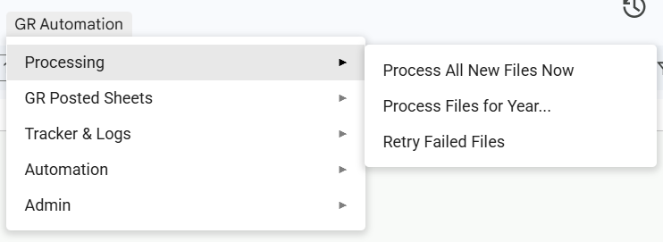
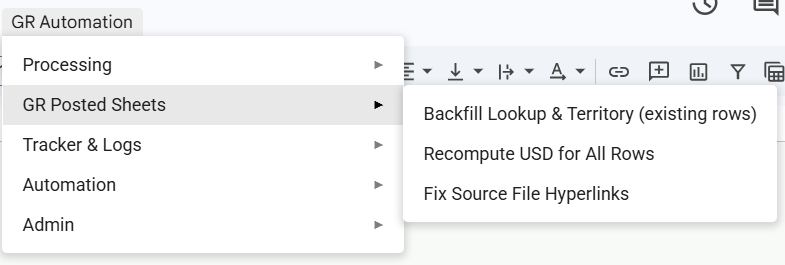
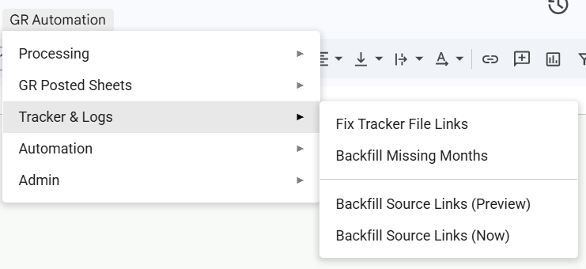
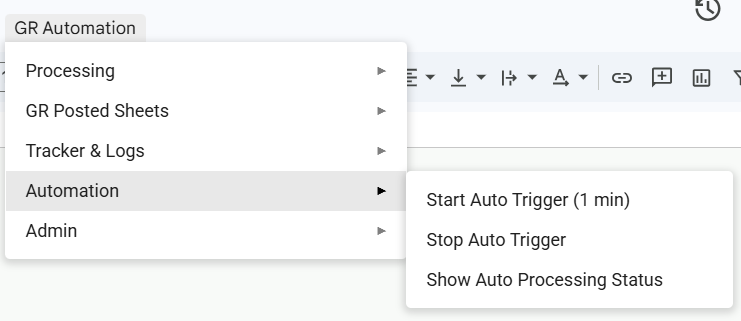
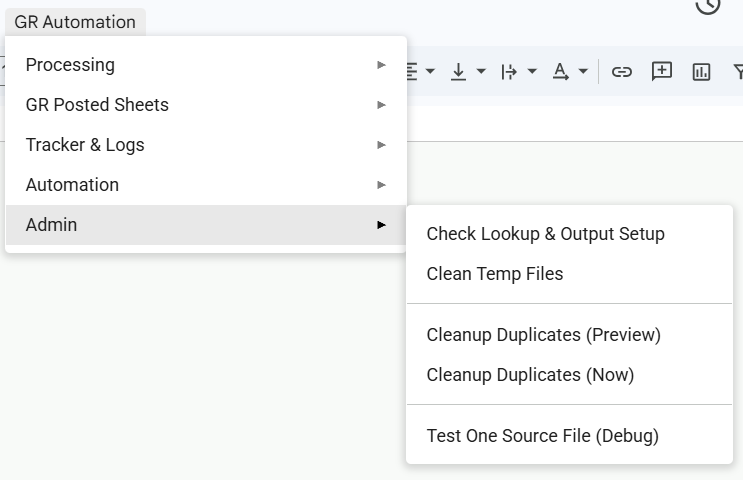

# GR Template Data Automation Consolidator

This repository is designed to manage GR Excel templates across Google Drive and consolidate them into a unified Google Sheets workflow. The code is structured for local development using `clasp`, while preserving the Apps Script behavior that executes inside Google Sheets.

**Script Version:** 11 | **Date Updated:** June 7, 2026

---

## Summary

This solution is designed to perform three core tasks reliably:

1. Detect new GR template files in a Drive folder.
2. Convert and parse them without manual cleanup.
3. Append clean, enriched rows into year-based reporting sheets.

This is a working automation pipeline with tracker logging, duplicate prevention, and automated trigger support.

---

## Design Intent

This project was developed to make GR consolidation more maintainable into a data pipeline.

- A modular codebase replaces a single monolithic Apps Script file.
- Safer, repeatable runs are enforced through limits designed to avoid timeouts.
- Data enrichment is enabled through PLA lookup tables and currency conversion.
- A clear audit trail is maintained for processed files.

---

## Solution Architecture

The process is organized into a structured pipeline:

```text
Drive Source Files
      ↓
Convert to Temp Google Sheets
      ↓
Parse sheets and detect headers
      ↓
Filter, normalize, enrich rows
      ↓
Append to year-based output sheets
      ↓
Log processing in Processed Files Log
```

The same flow with the main purpose of each stage:

| Stage | Purpose |
| --- | --- |
| Source | Discover Excel/Spreadsheet templates in Drive |
| Convert | Convert files into temporary Google Sheets |
| Parse | Identify the correct sheet/tab and extract row data |
| Enrich | Lookup PLA metadata, territory, and convert USD |
| Output | Append rows to the correct `GR Posted YYYY` sheet |
| Track | Save status and duplicate checks in `Processed Files Log` |

---

## Features & Capabilities

| Area | What is implemented |
| --- | --- |
| File discovery | Drive scanning with year detection and file filtering |
| Conversion | Excel → Sheets conversion using Drive advanced service |
| Parsing | Header detection, alias matching, summary/footer filtering |
| Enrichment | PLA lookup, territory mapping, USD conversion |
| Output | Year-based output sheets plus hyperlink source tracking |
| Tracking | Processed files log, failed attempt handling, dedupe checks |
| Automation | Time-based triggers and status diagnostics |
| Local development | `clasp` support with `main-scripts/` project layout |

---

## Repository Contents

| File / Folder | Purpose |
| --- | --- |
| `main-scripts/1_Config_And_Menu.gs` | Configuration, menu building, auto-trigger controls |
| `main-scripts/2_Main_Triggers.gs` | Consolidation orchestration and entry points |
| `main-scripts/3_Drive_And_Parsing.gs` | Drive file discovery, conversion, parsing logic |
| `main-scripts/4_Tracker_And_Sheets.gs` | Output sheet writing, tracker logging, duplicate prevention |
| `main-scripts/appsscript.json` | Apps Script manifest, Drive advanced service settings |
| `backups/` | Legacy script versions for reference and rollback |
| `docs/` | Supporting documentation, user manual, annotated code guide |
| `package.json` | Local tooling and `clasp` script commands |

---

## Development Workflow

Use `clasp` to synchronize changes and keep the Apps Script project aligned.

```bash
npm run clasp:login
npm run clasp:push
npm run clasp:pull
npm run clasp:status
```

The local source is stored in `main-scripts/` and syncs with the bound Apps Script project using `clasp`.

---

## Highlights

- The Drive advanced service (`Drive.Files`) is used for faster conversion and file discovery than the Spreadsheet UI alone.
- Runtime safeguards are included: file count limits, per-year limits, size checks, and skipped files after repeated failures.
- Output tracking is preserved by recording each processed file in `Processed Files Log` and checking multiple duplicate keys.
- A separate `PLA Lookup` sheet allows enrichment rules to be updated without modifying parsing logic.

---

## Supporting Documentation

Supporting documentation is included to explain the system in detail:

- `docs/GETTING_STARTED.md` — onboarding guide and architecture references
- `docs/ANNOTATED_CODE_GUIDE.md` — detailed code walk-through and architecture diagram
- `docs/USER_MANUAL_GR_CONSOLIDATION.md` — user-facing manual for running the automation
- `docs/SCRIPT_REFERENCE.csv` — function-level reference and feature mapping

Menu screenshots are preserved in `docs/img/`.

### Visual Overview











---

## Recommended Reading

1. Start with `docs/GETTING_STARTED.md` for the overall architecture.
2. Use `docs/ANNOTATED_CODE_GUIDE.md` for the internal flow and implementation details.
3. Refer to `docs/USER_MANUAL_GR_CONSOLIDATION.md` for end-user instructions.
4. Search `docs/SCRIPT_REFERENCE.csv` for function-specific behavior.

---

## License

All rights reserved.


